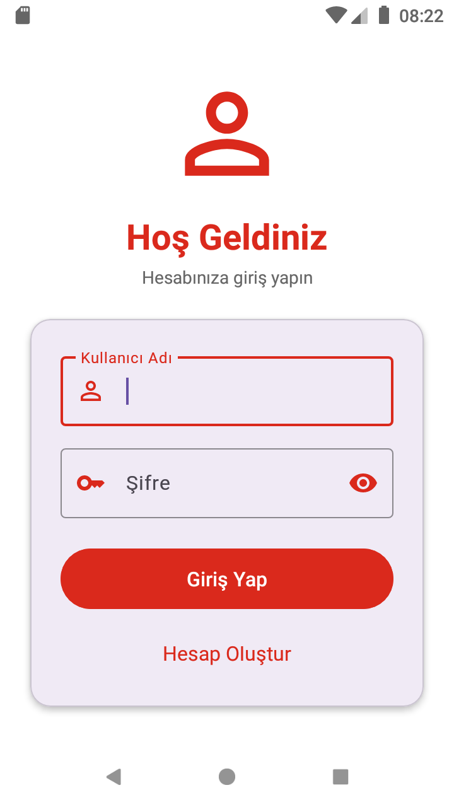
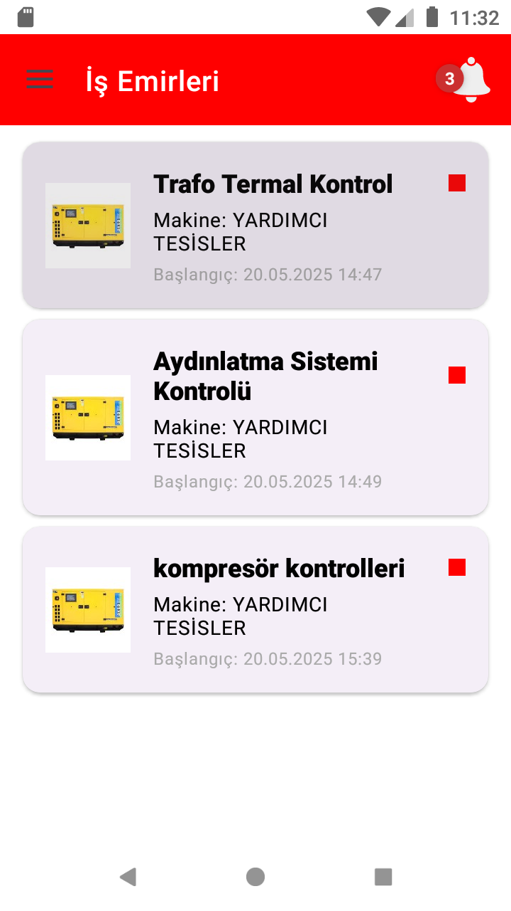
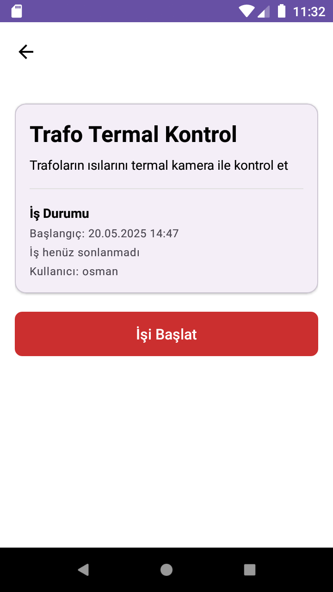
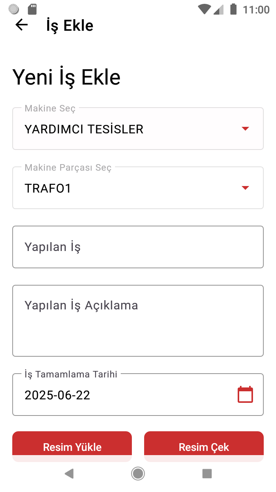
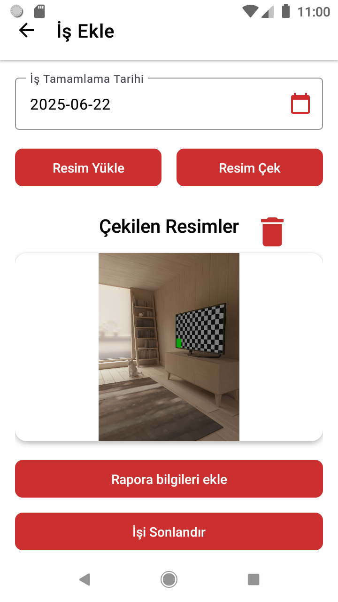

# İş Emri Takip Uygulaması (Android)

Bu proje, saha personelinin kendilerine atanan iş emirlerini mobil cihazları üzerinden kolayca takip etmelerini, tamamlanan işlere dair kanıt niteliğinde raporlar oluşturmalarını ve bu raporlara fotoğraf eklemelerini sağlayan native bir Android uygulamasıdır.

## Ana Özellikler

Uygulamanın mevcut sürümünde aşağıdaki temel işlevler bulunmaktadır:

*   **İş Emirlerini Listeleme:** Kullanıcılar, sisteme giriş yaptıktan sonra kendilerine atanmış olan tüm aktif iş emirlerini bir liste halinde görüntüleyebilir.
*   **İş Emri Detaylarını Görüntüleme:** Listeden herhangi bir iş emrine tıklandığında, işin tanımı, ilgili olduğu makine ve diğer önemli detayların yer aldığı bir sayfa açılır.
*   **İş Raporu Ekleme ve Tamamlama:** Personel, tamamladığı bir iş için uygulama üzerinden pratik bir şekilde rapor oluşturabilir. Bu rapor, işin tamamlandığını belgelemek için kullanılır.
*   **Fotoğraf Ekleme:** Raporlama ekranında, yapılan işi görsel olarak kanıtlamak amacıyla cihazın kamerasıyla yeni bir fotoğraf çekme veya galeriden mevcut bir fotoğrafı seçip rapora ekleme imkanı sunulmuştur.

## Ekran Görüntüleri

### 1. Kullanıcı Giriş Ekranı


### 2. İş Emri Listesi Ekranı


### 3. İş Emri Detay Sayfası


### 4. İş Raporu Ekleme Ekranı
  


## Teknik Yapı

*   **Platform:** Android (Native)
*   **Dil:** Java
*   **Ağ (Networking):** Backend API'si ile iletişim için **Retrofit** kütüphanesi kullanılmıştır.
*   **Mimari:** İstemci-Sunucu (Client-Server)
*   **Görsel Kütüphaneler:**
    *   **Glide:** Sunucudan gelen resimlerin veya galeriden seçilen fotoğrafların verimli bir şekilde yüklenmesi için kullanılmıştır.
    *   **ViewPager2:** Eklenen fotoğrafların bir slider içerisinde gösterimi için kullanılmıştır.

## Kurulum

1.  Bu repoyu klonlayın:
    ```bash
    git clone https://github.com/bizoncan/Staj_Deneme.git
    ```
2.  Projeyi Android Studio'da açın.
3.  Gradle senkronizasyonunun tamamlanmasını bekleyin ve projeyi derleyin.

> **Önemli Not:** Bu mobil uygulamanın çalışabilmesi için, API'nin çalışır durumda olamsı gerekmektedir. Backend projesinin reposuna [buradan]([BACKEND_PROJESININ_GITHUB_LINKINI_BURAYA_EKLEYIN]) ulaşabilirsiniz.
